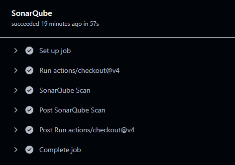

# API de Gestion de tâches collaboratives

## Description
Ce projet est une API qui permet aux utilisateurs de gérer des tâches et de collaborer avec les membres de l'équipe. Il offre des fonctionnalités telles que la création, la modification, la suppression de tâches et l'authentification des utilisateurs.

## Technologies utilisées
- Node.js
- Express
- Sequelize
- MariaDB
- Docker
- Kubernetes
- Jest
- Supertest
- Postman
- SonarQube

## Endpoints
- `POST /auth` - Créer ou Authentifier un utilisateur
- `POST /tasks` - Créer une nouvelle tâche
- `GET /users` - Afficher tous les utilisateurs
- `GET /tasks` - Afficher toutes les tâches
- `PUT /task/:id` - Mettre à jour une tâche
- `DELETE /task/:id` - Supprimer une tâche

## Sonarqube


## Tests
Ce projet inclut plusieurs types de tests pour garantir la qualité et la sécurité du code.

### Tests de sécurité
- **Prévention des injections SQL** : Vérifie que l'application est protégée contre les attaques par injection SQL.
- **Prévention des attaques XSS** : Vérifie que l'application est protégée contre les attaques par script intersite (XSS).
- **Hachage des mots de passe** : Vérifie que les mots de passe des utilisateurs sont correctement hachés avant d'être stockés.
- **Protection contre les attaques par force brute** : Limite le nombre de tentatives de connexion pour prévenir les attaques par force brute.

### Tests fonctionnels
- **Création d'utilisateur** : Vérifie que les utilisateurs peuvent être créés avec des informations valides.
- **Connexion d'utilisateur** : Vérifie que les utilisateurs peuvent se connecter avec des informations valides.
- **Création de tâche** : Vérifie que les tâches peuvent être créées avec des informations valides.
- **Modification de tâche** : Vérifie que les tâches peuvent être modifiées avec des informations valides.
- **Suppression de tâche** : Vérifie que les tâches peuvent être supprimées avec des informations valides.

### Tests d'intégration
- **Endpoints API** : Vérifie que les endpoints de l'API fonctionnent correctement et retournent les réponses attendues.
- **Base de données** : Vérifie que les opérations de base de données (création, lecture, mise à jour, suppression) fonctionnent correctement.

## Docker
Pour utiliser ce projet avec Docker :
```bash
docker-compose up --build
```

## Pipeline DevOps
Ce projet utilise un pipeline CI/CD pour automatiser les processus de développement, de test et de déploiement.

### CI/CD
Le pipeline CI/CD est défini dans le fichier [`.github/workflows/ci.yaml`](.github/workflows/ci.yaml). Il comprend les étapes suivantes :
1. **Build et Test** : 
   - Vérifie le code source et installe les dépendances.
   - Exécute les tests pour s'assurer que le code fonctionne correctement.
2. **Build Docker** :
   - Construit l'image Docker de l'application.
   - Pousse l'image Docker vers Docker Hub.
3. **Analyse SonarQube** :
   - Exécute une analyse de code avec SonarQube pour vérifier la qualité du code.

### Kubernetes
Le projet utilise Kubernetes pour le déploiement et la gestion des conteneurs. Les fichiers de configuration Kubernetes se trouvent dans le répertoire [k8s/](k8s/). Ils définissent les ressources suivantes :
- **Déploiements** : Gère le déploiement des applications et des bases de données.
- **Services** : Expose les applications et les bases de données pour permettre la communication entre elles.
- **Secrets** : Stocke les informations sensibles telles que les mots de passe de la base de données.


<!-- ## Installation
Pour installer le projet, clonez le dépôt et installez les dépendances :
```bash
git clone https://github.com/yourusername/collab_api.git
cd collab_api
npm install
```

## Utilisation
Pour démarrer le serveur, exécutez la commande suivante :
```bash
npm start
```
Le serveur démarrera sur `http://localhost:3000`.

### Étapes de conception :
1. **Analyse des besoins** : Identification des fonctionnalités nécessaires pour la gestion des tâches collaboratives.
2. **Conception de l'architecture** : Définition de l'architecture de l'API, choix des technologies (Node.js, Express, MariaDB).
3. **Mise en place de l'environnement de développement** : Configuration de l'environnement de développement, installation des dépendances.
4. **Développement des endpoints** : Création des routes pour l'authentification des utilisateurs et la gestion des tâches.
5. **Implémentation de la base de données** : Configuration de MariaDB pour stocker les utilisateurs et les tâches.
6. **Tests et débogage** : Tests unitaires, sécuritaires et d'intégration pour s'assurer du bon fonctionnement de l'API.
8. **Déploiement** : Déploiement de l'API sur un serveur de production. -->
